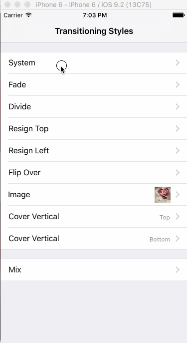
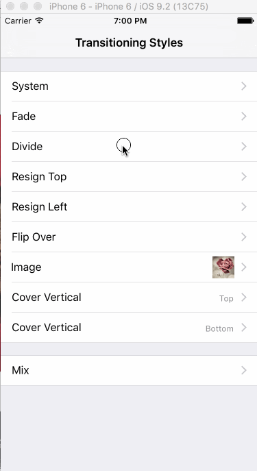
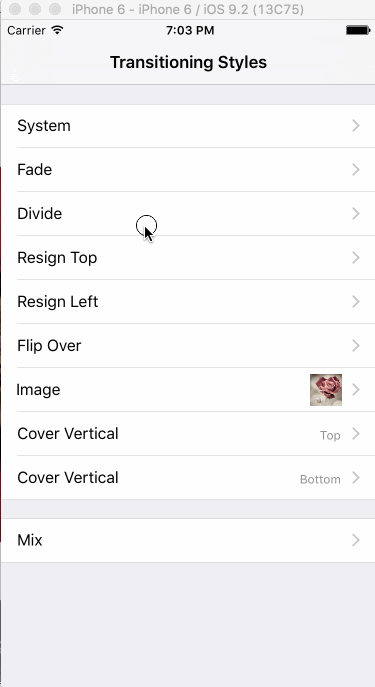
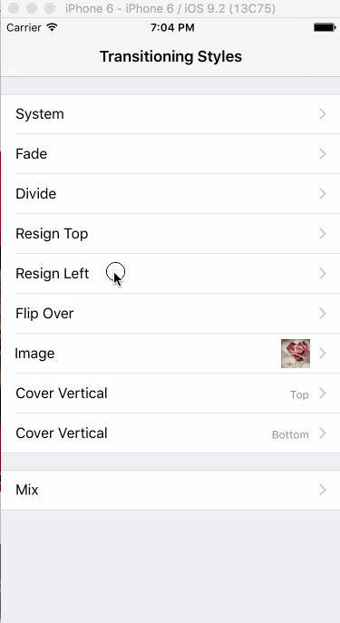
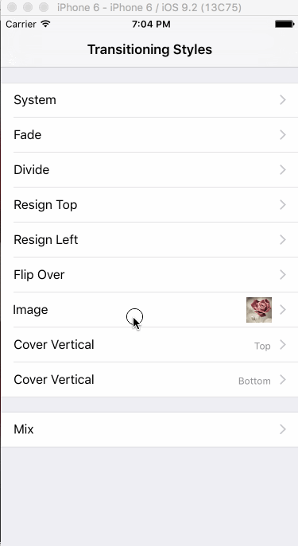
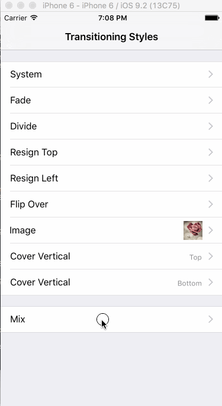

# UINavigationController-SLTransitioning
A UINavigationController category which contains multiple transitioning styles for use, like System (Default), Fade, Divide, Resign Top, Resign Left, Filp Over, Image and Cover Vertical (Top or Bottom). What makes it more meaningful is that you can easily add your custom beautiful transitioing style into it. But, there are still some shortages, like the lack of interactive pop geatures. Maybe I will think of a good idea to solve it, or you can be the solver.

Anyway, Let's enjoy it. Thanks to [《你今天真好看》](http://www.amazon.cn/你今天真好看-莉兹·克里莫/dp/B010SK9Z34/ref=sr_1_1?ie=UTF8&qid=1457503887&sr=8-1&keywords=你今天真好看) for drawings in my project.

##Styles
###System

###Fade

###Divide

###Resign Top

###Resign Left

###Flip Over

###Image

###Cover Vertical (Top)

###Cover Vertical (Bottom)

###*Mix*


##Requirement
Because it is based on `UIViewControllerAnimatedTransitioning`, So:

- iOS 7.0 +
- ARC 

##Installation
###CocoaPods
```ruby
pod 'UINavigationController+SLTransitioning', '~> 1.0.0'
```
###Manually
Add `Source` directory into you project, and it's better to rename it to `UINavigationController+SLTransitioning`. In any file you want to use it, Add `#import "UINavigationController+SLTransitioning.h"`, then use it!

##Usage
###Basic
Like I say above, It's very simple to use, and you can see some of its usage in `Demo.xcodeproj`.

```objc
@interface UINavigationController (SLTransitioning)
@property (nonatomic, assign) SLNavigationTransitioningStyle transitioningStyle;
@property (nonatomic, assign) BOOL symmetrical;
@property (nonatomic, assign) SLCoverDirection coverDirection;
@end
```

To achieve a transitioning style for a navigation controller, set its `transitioningStyle` property to the specific style. After that, you will see the result when pushing. But when poping, it depends on `symmetrical` property, which is a very subtle object, I will talk about it later.

Remember that `transitioningStyle` affects the whole transitioning style at the level of `UINavigationController`. Now, Let's look at the individual navigation transitioning style for single view controller.

```objc
@interface UIViewController (SLTransitioning)
@property (nonatomic, assign) SLNavigationTransitioningStyle navigationTransitioningStyle;
@end
```

For some veiw controllers, you just want their transitioning styles special but keep the navigation controller's style still. `navigationTransitioningStyle` property of `UIViewController` is your favorite thing. You just set it on this kind of view controllers, then go to drink a coffee and everything is ok. Keep in mind that  if A -> B and you want change the transitioning style between them, you should set it on A, not B. 

You will find it similar to `navigationItem`. Yes, I try to make it like that. 

Some transitioning styles like Divide, Image, Cover Vertical have special keys of info to used in the methods of `SLTransitioningDelegate`. They maybe be puzzling, so read the code in `Demo`, you will figure them out.

###Advancement
I want to talk about its principle. The heart of this category is the `navigationController:animationControllerForOperation:fromViewController:toViewController:` method of `TransitioningProxy` in `UINavigationController+SLTransitioning.m`. You can read it to figure my all thoughts out.

In fact transitioning style is always symmetrical, meaning that when A -> B, A is moved to left, then when B back to A (B -> A), A is moved from left. To realize this symmetry, I keep track of transitioning style when pushing, and examine the `symmetrical` property to decide whose duty for **popping** style. Considering a condition that B pop to A, If `symmetrical == YES`, I keep the order to find the style which is not nil: last push style, then `navigationTransitioningStyle` of A, then `transitioningStyle` of navigation Controller; If NO, the order is `navigationTransitioningStyle` of B, then `transitioningStyle` of navigation Controller. **When `symmetrical == NO`, it will probably fail to get the effect of transitioning style because many styles depend on snapshots created in the process of pushing before. So, Always keep `symmetrical` to YES, which is also the default value, except that you know what you are doing.**

Another point which needs your attention is that you can get your own custom transitioning by one of th e following three ways:

1. Set `delegate` of navigation controller to one object which conforms to `UINaivgationControllerDelegate`, and implement `navigationController:animationControllerForOperation:fromViewController:toViewController` method (If you want to get the system transitioning, not noly return nil, and set `SLNavigationTransitioningStyleSystem` to the navigation controller or the view controller). In this way, you can completely suppress my transitioning styles and control all transitionings when navigating. If you want my transitioning styles back, set `delegte` to `nil`.
2. Make `UIViewController` conform to `UINavigationControllerDelegate` and implememnt `navigationController:animationControllerForOperation:fromViewController:toViewController` method, when navigating to it or navigating from it, return value except nil of this method will be used probably (examing `symmetrical`).
3. **RECOMMEND:** You can create a transitioning style like I did. Subclass`SLBaseAnimatedTransitioning` and do your implement, referring to my existing animated transitioings. After you complete the animated transitioning class, you integrate it into the `UINavigationController+SLTransitioning` class and `SLNavigationTransitioningStyle.h`, I have make a sign to mark such places: `// EXTEND`. 

Because I am not good at English, my explantation may be terrible and make things more complex. So, read my code, and my code will tell you everything.

##Shortage
1. Interactive Pop Gesture: I keep the navigation controller's interactive pop gesture, so it's ok when using `SLNavigationTransitioningStyleSystem`. But for others theres is just a pop gesture, not interactive. I'm not sure if I will add this capability to it because I have no good ideas, maybe this problem is left for you.
2. A Little Hack: most animations of my animated transitioings are implemented at the level of window, or the base view of window, due to Apple's limitation like fixed navigation bar and its animtation. Apple hopes developers to make animations in the `containerView`. So, god knows this kind of implement is right or not.

##In the End
Pull requests are all welcome, and I'm glad to see more and more transitioning styles. I think the most important of my project is to provide an idea to implement custom transitioning of view controllers. Hope it will help you.

##MIT License
```
The MIT License (MIT)

Copyright (c) 2015 Soul

Permission is hereby granted, free of charge, to any person obtaining a copy
of this software and associated documentation files (the "Software"), to deal
in the Software without restriction, including without limitation the rights
to use, copy, modify, merge, publish, distribute, sublicense, and/or sell
copies of the Software, and to permit persons to whom the Software is
furnished to do so, subject to the following conditions:

The above copyright notice and this permission notice shall be included in all
copies or substantial portions of the Software.

THE SOFTWARE IS PROVIDED "AS IS", WITHOUT WARRANTY OF ANY KIND, EXPRESS OR
IMPLIED, INCLUDING BUT NOT LIMITED TO THE WARRANTIES OF MERCHANTABILITY,
FITNESS FOR A PARTICULAR PURPOSE AND NONINFRINGEMENT. IN NO EVENT SHALL THE
AUTHORS OR COPYRIGHT HOLDERS BE LIABLE FOR ANY CLAIM, DAMAGES OR OTHER
LIABILITY, WHETHER IN AN ACTION OF CONTRACT, TORT OR OTHERWISE, ARISING FROM,
OUT OF OR IN CONNECTION WITH THE SOFTWARE OR THE USE OR OTHER DEALINGS IN THE
SOFTWARE.
```